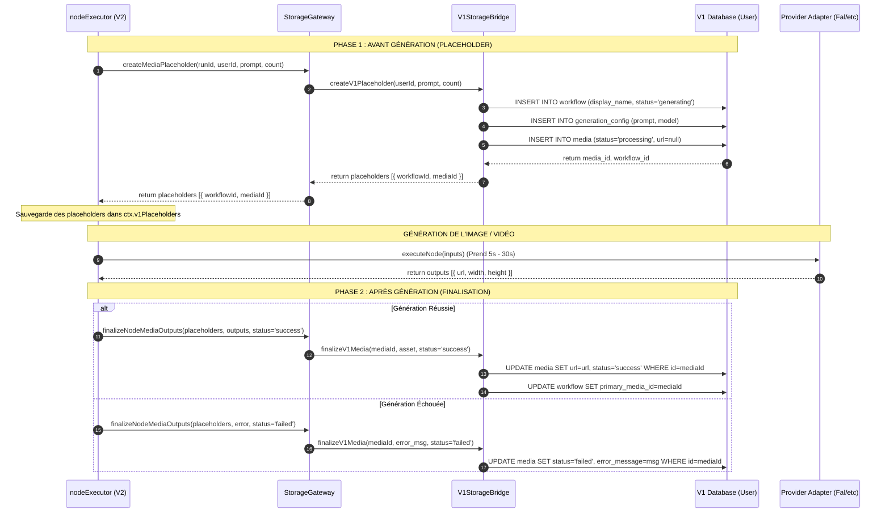

# Plan de Migration Directe V2 — Version Finale & Analyse des Risques

Ce document contient le plan de migration complet ainsi qu'une analyse des problèmes potentiels identifiés et de leurs solutions de contournement (atténuations).

---

## 📊 Diagrammes de Séquence & Transition (Rappel)

### Flow d'Exécution 2-Phases

---

## 🔧 Architecture & Changements du Code

1. **Suppression des traitements V1** : Retirer `src/image/treatments/`, `src/video/treatments/`, `UpscaleTreatment`, `ElementSheetTreatment`.
2. **Nouveaux workflows V2** : Enregistrer `upscale-v1.yaml` et `edit-video-v1.yaml` dans `src/v2/registry/workflows/`.
3. **Double phase de stockage V1** :
   * `createV1Placeholder` dans le bridge et gateway.
   * `finalizeV1Media` pour mettre à jour l'URL et le statut (`success`/`failed`).
4. **Refactoring des contrôleurs V1** :
   * Réception des payloads V1.
   * Utilisation du **Payload Mapper** (`v1PayloadMapper.js`) pour convertir en inputs V2.
   * Lancement direct de `startWorkflowRun()`.
   * Retour de la réponse compatible V1 avec les IDs des placeholders.

---

## ⚠️ Problèmes Potentiels & Atténuations

Après analyse, voici les 4 risques techniques majeurs identifiés et les solutions prévues :

### 1. Perte du Projet/Session Actuel (Overwriting avec 'V2 Works')
* **Le problème** : Si l'utilisateur lance une génération depuis un projet existant "Projet X" et une session "Session Y", le V1StorageBridge ne doit pas forcer la création dans le projet générique "V2 Works".
* **L'atténuation** : Le bridge V1 doit vérifier si `projectId` et `sessionId` sont fournis dans les inputs résolus du workflow V2. Si oui, il doit associer le nouveau workflow à ces identifiants. Il n'utilise le projet "V2 Works" que comme fallback si aucun projet n'est spécifié.

### 2. Résolution des IDs Médias en Objets `source_asset`
* **Le problème** : Pour les éditions, extensions et caméra-moves d'images/vidéos, le frontend V1 envoie des IDs (`workflow_id`, `media_id`). Mais les nodes V2 (`media-transform`, `upscale`) ont besoin d'un objet `source_asset` contenant l'URL, la largeur et la hauteur de l'image source.
* **L'atténuation** : Avant de démarrer le run V2, le contrôleur ou le mapper layer doit interroger la DB V1 pour charger l'URL et les dimensions du média d'origine, et construire l'objet `source_asset` à passer en paramètre d'entrée au moteur V2.

### 3. Blocage en Statut `processing` indéfini (Server Crash/Restart)
* **Le problème** : Si le serveur redémarre pendant que le provider (Fal/Runway) génère l'image (entre la Phase 1 et la Phase 2), le média restera indéfiniment faim en statut `processing` dans la base de données de l'utilisateur.
* **L'atténuation** :
  1. Lors du démarrage du serveur, implémenter un script de nettoyage simple qui recherche tous les médias en cours de traitement (`processing`) liés à des runs V2 orphelins (runs dont le statut dans `v2_workflow_runs` est interrompu ou crashé) et les marquer en `failed`.
  2. Profiter de la robustesse de BullMQ qui ré-exécute les jobs interrompus lors d'un restart.

### 4. Alignement des Comptes d'Assets
* **Le problème** : L'utilisateur demande 4 variations d'image (`count: 4`). Si le node executor ne crée qu'un seul placeholder, le frontend affichera un seul spinner au lieu de 4.
* **L'atténuation** : Le helper `createNodeMediaPlaceholders` doit lire explicitement la variable `count` depuis les inputs résolus du node et exécuter une boucle pour insérer autant de placeholders en base de données V1 que demandé par l'utilisateur.
